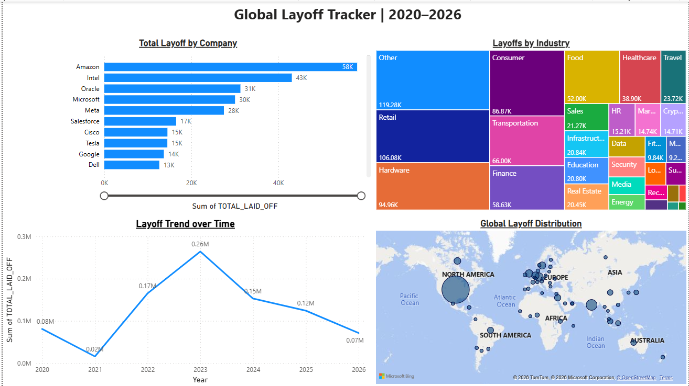

# Global Layoff Tracker | 2020–2026


## Project Overview
An end-to-end ELT data engineering project that tracks
global tech layoffs from 2020-2026 across 50+ countries.

## Architecture
CSV Data (Kaggle) → Python → Snowflake RAW → Snowflake CLEAN → Power BI Dashboard

## Tech Stack
- **Python** — data upload automation
- **Snowflake** — cloud data warehouse
- **SQL** — data transformation and analysis
- **Power BI** — dashboard and visualization
- **GitHub** — version control

## Dataset
- **Source:** Kaggle (Layoffs dataset)
- **Records:** 4,342 layoff events
- **Date Range:** March 2020 to April 2026
- **Fields:** Company, Industry, Country, Total Laid Off, Percentage, Funding Stage

### Extract
- Downloaded layoff data from Kaggle as CSV
- Uploaded to Snowflake internal stage using Python connector

### Load
- Loaded RAW data as-is into RAW.layoffs_raw table
- Used COPY INTO command for bulk loading
- Kept original data untouched in RAW schema

### Transform
- Removed rows with null company names
- Converted date strings to proper DATE format
- Trimmed whitespace from all text columns
- Standardized NULL values across all columns
- Created CLEAN.layoffs_clean with all transformations
- Transformations done INSIDE Snowflake using SQL

## Analysis Performed

### Basic Analysis
1. Top 10 companies by total layoffs
2. Industry impact with average percentage laid off
3. Year over year layoff trends
4. Country wise layoff distribution
5. Monthly layoff trend over time
6. Company funding stage analysis

### Advanced Analysis
7. Rolling 3 month layoff totals using Window Functions
8. Year over year change by industry using LAG function
9. Company rankings within each industry using RANK function
10. Country percentage contribution to global layoffs

## Key Findings
- Amazon had the highest layoffs with 58,124 employees
- Retail and Hardware industries were hit hardest
- United States accounted for majority of global layoffs
- Layoffs peaked in 2022 and 2023 post pandemic

## 📸 Dashboard Preview



## Project Structure

```
layoff-tracker/
│
├── data/
│   └── layoffs.csv
│
├── python/
│   └── upload.py
│
├── sql/
│   ├── 01_setup.sql
│   ├── 02_create_tables.sql
│   ├── 03_load_data.sql
│   ├── 04_clean_data.sql
│   └── 05_analysis.sql
│
└── README.md
```

## Author
Prakash Karunanithi
- MS Information Systems — University of North Texas
- AWS Certified Data Engineer Associate
- LinkedIn: (https://www.linkedin.com/in/prakash-karunanithi-076965244/)
- GitHub: karuprak